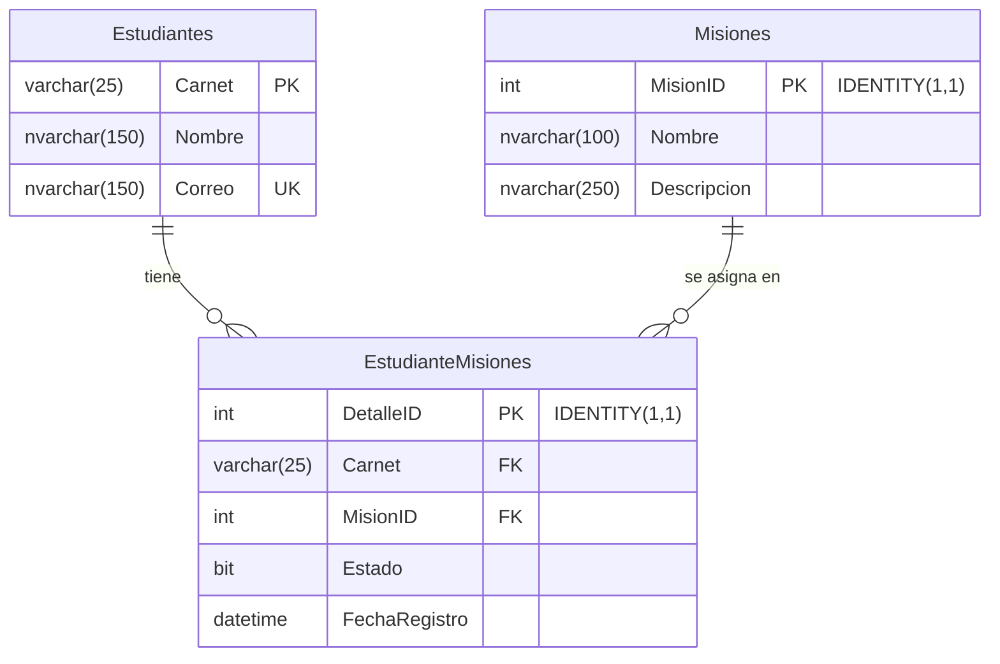

# 🚀 API Maestro-Detalle con Catálogo y Control de Estado

> **Universidad Mariano Gálvez de Guatemala (UMG)**  
> **Curso:** Desarrollo Web | Octavo Ciclo  
> **Estudiante:** Albino Sebastián Rosales Ruano  
> **Carnet:** `1890-23-12105` | **Correo:** `arosalesr13@miumg.edu.gt`  
> **🌐 Sitio Web Publicado (Vercel):** [https://maestro-detalle-project.vercel.app/](https://maestro-detalle-project.vercel.app/)  
> **📚 Documentación Swagger UI en Vivo:** [https://maestro-detalle-project.vercel.app/api-docs](https://maestro-detalle-project.vercel.app/api-docs)  
> **🐙 Repositorio GitHub:** [https://github.com/codsebas/maestro-detalle-project](https://github.com/codsebas/maestro-detalle-project.git)  

---

## 📌 1. Descripción del Proyecto

Solución Full-Stack de **API RESTful** y **Tablero de Avance (Dashboard)** para el control y seguimiento del progreso de misiones académicas en una arquitectura **Maestro-Detalle**.

El sistema procesa en un solo endpoint `POST /api/registro` el encabezado del estudiante (Maestro) y la lista de misiones (Detalle), realizando las siguientes acciones:
1. **Insertar estudiante** si no existe por su carnet.
2. **Actualizar datos del estudiante** si ya existe (nombre/correo).
3. **Validar existencia de los IDs de misión** en el catálogo oficial de la BD. Si algún ID no existe, retorna un **Error de Referencia** (`400 Bad Request`).
4. **Insertar o actualizar el estado (`true`/`false`)** de cada misión en el detalle.
5. **Control de Múltiples POST:** Permite envíos repetidos manteniendo la integridad y consistencia de la información.

---

## 🏛️ 2. Modelo Relacional de Base de Datos (ERD)



### Credenciales de Base de Datos (SQL Server Azure)
- **Servidor:** `svr-sql-ctezo.southcentralus.cloudapp.azure.com`
- **Base de Datos:** `db_WebDevUMG`
- **Usuario:** `UsuarioEncuestas`
- **Contraseña:** `DesaWeb2025$!`

---

## 📡 3. Especificación de Endpoints API

### 1. `POST /api/registro`
Recibe el JSON maestro-detalle y procesa la transacción en la BD.

**Ejemplo de JSON enviado:**
```json
{
  "maestro": {
    "carnet": "1890-23-12105",
    "nombre": "ALBINO SEBASTIÁN ROSALES RUANO",
    "correo": "arosalesr13@miumg.edu.gt"
  },
  "detalle": [
    {
      "misionId": 1,
      "estado": true
    },
    {
      "misionId": 2,
      "estado": false
    },
    {
      "misionId": 3,
      "estado": true
    }
  ]
}
```

**Respuesta Exitosa (`200 OK`):**
```json
{
  "status": "success",
  "message": "Estudiante y misiones procesados correctamente",
  "data": {
    "carnet": "1890-23-12105",
    "nombre": "ALBINO SEBASTIÁN ROSALES RUANO",
    "correo": "arosalesr13@miumg.edu.gt",
    "misionesProcesadas": 3
  }
}
```

**Respuesta Error de Referencia (`400 Bad Request`):**
```json
{
  "status": "error",
  "error": "Error de referencia",
  "message": "Error de referencia: Las misiones con ID (99) no existen en el catálogo de Misiones.",
  "invalidMisionIds": [99]
}
```

---

### 2. `GET /api/misiones`
Consulta el catálogo oficial de misiones disponibles.

**Respuesta Ejemplo:**
```json
{
  "status": "success",
  "total": 5,
  "data": [
    {
      "MisionID": 1,
      "Nombre": "Instalación de herramientas",
      "Descripcion": "Configuración de entorno de desarrollo y repositorio Git"
    }
  ]
}
```

---

### 3. `GET /api/estudiantes`
Consulta el avance de todos los estudiantes y el estado de sus misiones.

---

### 4. `GET /api-docs` (Documentación Swagger UI)
Documentación interactiva OpenAPI 3.0 para probar los endpoints en línea directamente desde el navegador:  
👉 **[https://maestro-detalle-project.vercel.app/api-docs](https://maestro-detalle-project.vercel.app/api-docs)**

---

## 🖥️ 4. Tablero Frontend Dashboard

El proyecto incluye una aplicación web interactiva responsiva con:
- **Resumen de Avance:** Porcentaje de completación ($0\% - 100\%$) e indicadores de avance global.
- **Detalle de Misiones:** Desglose del estado de cada misión por estudiante.
- **Búsqueda y Autocompletado en Tiempo Real por Carnet:** Al ingresar un carnet registrado, autocompleta el nombre, correo y estado de misiones. Al escribir un carnet nuevo, se limpian los campos automáticamente.
- **Probador de POST Integrado con Editor de Código:** Permite enviar desde formulario o editar directamente el JSON con validador de errores de sintaxis en tiempo real.
- **Tema:** Modo Claro (*Light Mode*) estilizado.

---

## 💻 5. Instrucciones de Ejecución Local

1. **Clonar repositorio e instalar dependencias:**
   ```bash
   git clone https://github.com/codsebas/maestro-detalle-project.git
   cd maestro-detalle-project
   npm install
   ```

2. **Ejecutar el servidor local:**
   ```bash
   npm start
   ```

3. **Acceso en el navegador:**
   - **Tablero Frontend:** `http://localhost:3000`
   - **Swagger UI:** `http://localhost:3000/api-docs`
   - **Endpoint Registro:** `http://localhost:3000/api/registro`

---

## 🌐 6. Despliegue en la Nube (Vercel)

El proyecto se encuentra desplegado y funcionando en Vercel con arquitectura Serverless y conexión perezosa (*Lazy Connection*) a SQL Server:
- **URL Pública:** [https://maestro-detalle-project.vercel.app/](https://maestro-detalle-project.vercel.app/)